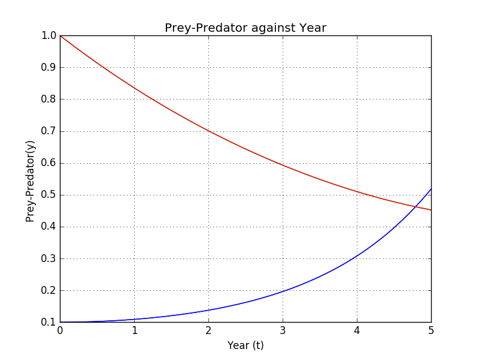
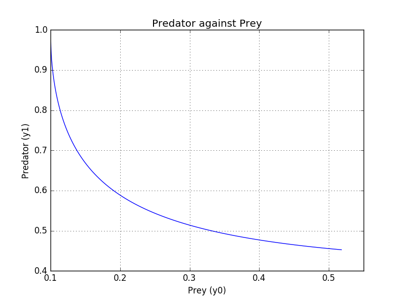

UECM3033 Assignment #3 Report
========================================================

- Prepared by: ** Yang Guang Tosng **
- Tutorial Group: T2

--------------------------------------------------------

## Task 1 --  Gauss-Legendre formula

The reports, codes and supporting documents are to be uploaded to Github at: 

[https://github.com/tiago5829/UECM3033_assign3](https://github.com/your_github_id/UECM3033_assign3)

Explain how you implement your `task1.py` here.

First of all, we imported the numpy and sympy as np and sy respectively. We used function gausslegendre,in order to implement the N-point Gauss-Legendre quadrature,use the polynomial.legendre.leggauss to compute the sample points for Gauss-Legendre quadrature. The default interval for Gauss-Legendre quadrature is [-1,1]. For the interval,we use t =0.5(x+1)(b-a)+a to change from [-1,1] to [a,b] . Then the answer return to gausslegendre function will be the multiplication of the sum of (w*f(t)) and half of the difference of upper and lower limit.

In the main function, the self-defined function named my_integral will return answer for integration. Lastly, we used answer of my_integral to compare as the answer returned by gausslegendre, which I=0.400338097411

Explain how you get the weights and nodes used in the Gauss-Legendre quadrature.

The weights and nodes can be get by importing numpy.polynomial.legendre.leggauss.

---------------------------------------------------------

## Task 2 -- Predator-prey model

Explain how you implement your `task2.py` here, especially how to use `odeint`.

Put your graphs here and explain.

When the y0 is 0.1, y1 is 1.0.

When the y0 is 0.11, y1 is 1.0.

.png)
.png)

Is the system of ODE sensitive to initial condition? Explain.

-----------------------------------

last modified: change your date here
